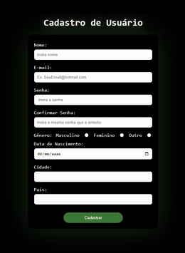

# Tela de Cadastro 📝

Este projeto é uma tela de cadastro de usuários feita com **HTML** e **CSS**, com foco em layout limpo e animações sutis para melhor experiência do usuário.

## 💻 Demonstração

> Acesse online: [Clique aqui para ver o projeto rodando](https://luccachris.github.io/tela-cadastro/)

## ✨ Funcionalidades

- Campos de preenchimento para:
  - Nome
  - E-mail
  - Senha e confirmação
  - Gênero
  - Data de nascimento
  - Cidade e país
- Validação básica com `required`
- Estilização responsiva com destaque de sombras animadas
- Botão com efeito hover

## 🛠 Tecnologias utilizadas

- HTML5
- CSS3 (animações, responsividade e efeitos visuais)

## 🗂 Estrutura do Projeto

- `index.html` — Estrutura da tela de cadastro.
- `styles.css` — Estilos visuais e animações do formulário.
- `README.md` — Documentação do projeto.

## 📌 Observações

- Este projeto é estático e não envia os dados para nenhum backend.
- Ideal para fins de estudo ou como base para projetos maiores.

---

## 👨🏻‍💻 Autor
Desenvolvido por [Chris Lucca](https://github.com/LuccaChris)
